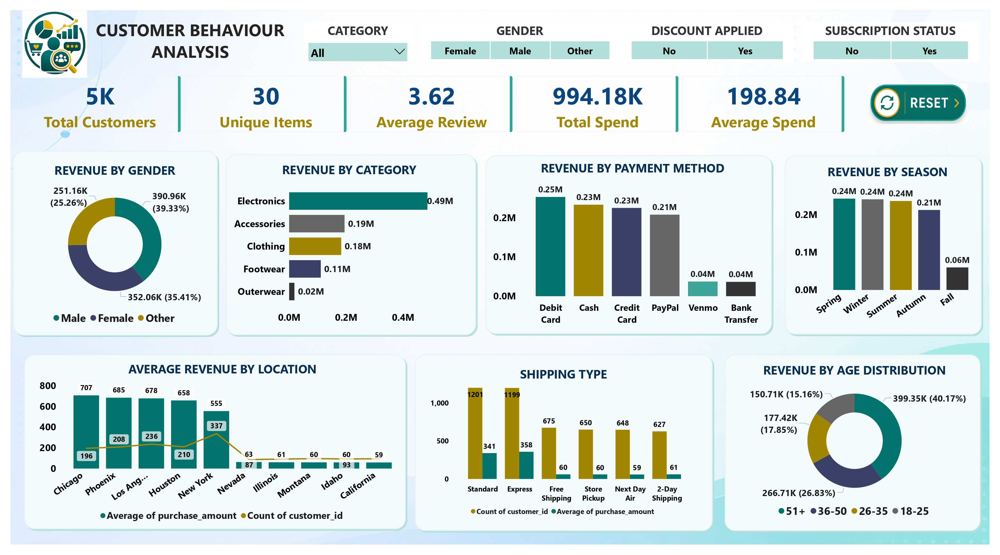
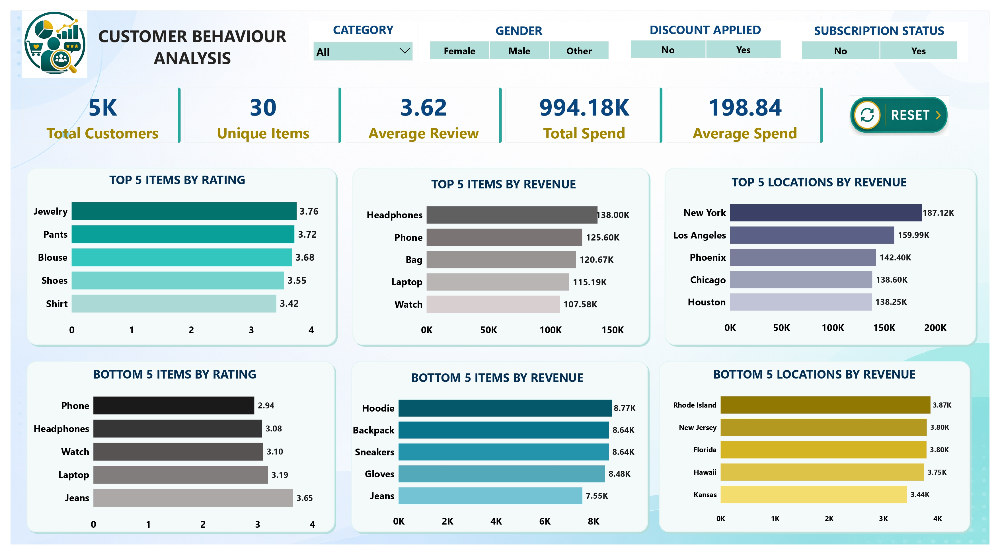

# Customer Shopping Behaviour Analysis
### End-to-End Data Analytics Project | Python - MySQL - Power BI

Analyzing customer shopping behaviour to uncover revenue patterns, customer segmentation insights, and strategic business recommendations using Python, MySQL, and Power BI.

---

## Table of Contents

- [Overview](#overview)
- [Business Problem](#business-problem)
- [Dataset](#dataset)
- [Tools and Technologies](#tools-and-technologies)
- [Data Cleaning and Preparation](#data-cleaning-and-preparation)
- [Exploratory Data Analysis](#exploratory-data-analysis)
- [SQL Analysis](#sql-analysis)
- [Dashboard](#dashboard)
- [Key Findings](#key-findings)
- [How to Run This Project](#how-to-run-this-project)
- [Final Recommendations](#final-recommendations)
- [Author and Contact](#author-and-contact)

---

## Overview

This project analyzes customer shopping behaviour using transactional data from 5,000+ customer purchases across multiple product categories. The objective was to identify meaningful patterns in customer spending, purchasing preferences, subscription trends, and revenue generation - supporting more informed and strategic business decisions.

---

## Business Problem

In the e-commerce industry, businesses closely monitor customer interactions to better understand consumer behavior and purchasing trends. This project aims to:

- Identify which product categories and items drive the most revenue
- Understand how discounts impact purchase value and profit margins
- Analyze revenue distribution across gender, age group, and location
- Determine spending differences between subscribed and non-subscribed customers
- Segment customers into New, Returning, and Loyal groups
- Evaluate shipping type preferences and their effect on average spend
- Understand seasonal demand patterns to support inventory planning

---

## Dataset

- Source: [customer_shopping_behavior.csv](customer_data.csv)
- Size: 5,050 records - 17 columns
- Type: Retail / E-commerce - Structured (Tabular)

| Column | Type | Description |
|---|---|---|
| customer_id | Numeric | Unique customer identifier |
| age | Numeric | Age of the customer |
| gender | Categorical | Male / Female / Other |
| item_purchased | Categorical | Specific product purchased |
| category | Categorical | Product category |
| purchase_amount | Numeric | Amount spent (USD) |
| location | Categorical | US State |
| size | Categorical | Product size (S, M, L, XL) |
| color | Categorical | Product color |
| season | Categorical | Season of purchase |
| review_rating | Numeric | Customer rating (1-5) |
| subscription_status | Categorical | Subscribed Yes/No |
| shipping_type | Categorical | Shipping method selected |
| discount_applied | Categorical | Discount used Yes/No |
| previous_purchases | Numeric | Number of past purchases |
| payment_method | Categorical | Mode of payment |
| frequency_of_purchases | Categorical | Purchase frequency |

---

## Tools and Technologies

- Python (Pandas, Matplotlib, Seaborn)
- MySQL (CTEs, Subqueries, Window Functions)
- Power BI (Interactive Visualizations)
- Jupyter Notebook
- GitHub

---

## Data Cleaning and Preparation

Performed in Python using Pandas before passing cleaned data to MySQL:

- Removed 50 duplicate records based on Customer ID
- Imputed missing Review Ratings using product-level median rating
- Handled missing Size values using domain logic:
  - Electronics and Accessories - Not Applicable
  - Footwear - Free Size
  - Clothing - mode of that category
- Replaced missing Purchase Amount with mean value
- Replaced missing Previous Purchases with 0
- Corrected category inconsistencies using a mapping dictionary
- Standardized all column names for SQL and Power BI compatibility
- Exported cleaned DataFrame to MySQL using SQLAlchemy

---

## Exploratory Data Analysis

Initial exploration using df.head(), df.info(), df.describe(), and df.isnull().sum() to understand structure, data types, and missing values.

Missing values identified:
- Review Rating: 601 missing
- Purchase Amount: 556 missing
- Previous Purchases: 548 missing
- Size: 370 missing

Data consistency check:
- Found inconsistencies between item names and assigned categories
- Created a mapping dictionary and corrected all category values

---

## SQL Analysis

12 structured business questions answered using MySQL:

- GROUP BY, SUM, AVG, ORDER BY
- Subqueries
- CASE WHEN statements
- RANK, PARTITION BY window functions

---

## Dashboard

An interactive two-page Power BI dashboard built with slicers for Category, Gender, Discount Applied, and Subscription Status.

Page 1 - Customer Overview



Page 2 - Rankings and Performance



---

## Key Findings

- Electronics is the highest revenue category at 486K - nearly 2.5x the second-ranked Accessories at 194K
- Customers using discounts spend more on average (219 USD) vs. non-discount customers (182 USD)
- Subscribed customers generate significantly higher average spend (270.58 USD) vs. non-subscribers (165.72 USD)
- 51+ age group is the top revenue contributor at 399K which is 40% of total revenue
- Loyalty dominates: 3,085 Loyal customers vs. 1,354 Returning and 561 New
- Laptop, Phone and Headphones show highest discount dependency with above 50% of sales using a discount
- Debit Card is the most preferred payment method at 0.25M revenue
- Spring, Winter and Summer are peak seasons; Fall significantly underperforms at 60K vs 240K+ for other seasons
- New York is the top revenue-generating city at 187K
- Express shipping customers have a higher average spend (358 USD) vs. Standard (341 USD)

---

## How to Run This Project

1. **Clone the repository**
```
git clone https://github.com/manshasinha/customer-shopping-behaviour-analysis-python-sql-powerbi
```
2. **Open the Jupyter Notebook**
   - Open `eda_customer_data.ipynb`
   - Run all cells sequentially

3. **Set up MySQL**
   - Create a database named `customer_behaviour` in MySQL Workbench
   - The notebook exports cleaned data directly to MySQL via SQLAlchemy

4. **Run SQL Queries**
   - Open `customer_behaviour_analysis.sql` in MySQL Workbench
   - Execute queries against the `customer_behaviour_analysis` table

5. **Open Power BI Dashboard**
   - Open `customer_behaviour_dashboard.pbix` in Power BI Desktop


---

## Final Recommendations

- Subscription Program: Promote exclusive subscriber benefits such as early access, free shipping, and loyalty points to increase subscription rate and customer lifetime value
- Discount Strategy: Retain discounts for Electronics where dependency is high but reduce on Clothing and Footwear to protect margins
- Customer Retention: Introduce loyalty tier incentives targeting the 1,354 Returning customers to convert them to Loyal
- Product Positioning: Promote top-rated items (Jewelry, Pants, Blouse) in marketing campaigns and work on improving Phone and Headphone ratings
- Shipping Upsell: Promote Express and 2-Day shipping options as these customers already spend more on average
- Age-Group Marketing: Focus campaigns on 51+ and 35-50 segments which are top revenue contributors
- Seasonal Planning: Align inventory and promotions with Spring and Summer peak seasons and run targeted campaigns to boost Fall revenue

---

## Author and Contact

Mansha Sinha
Data Analyst

Email: manshasinha3110@gmail.com
LinkedIn: https://www.linkedin.com/in/mansha-sinha-9504a0214
